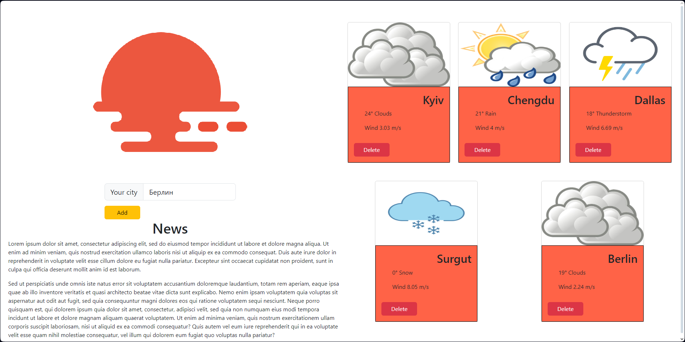
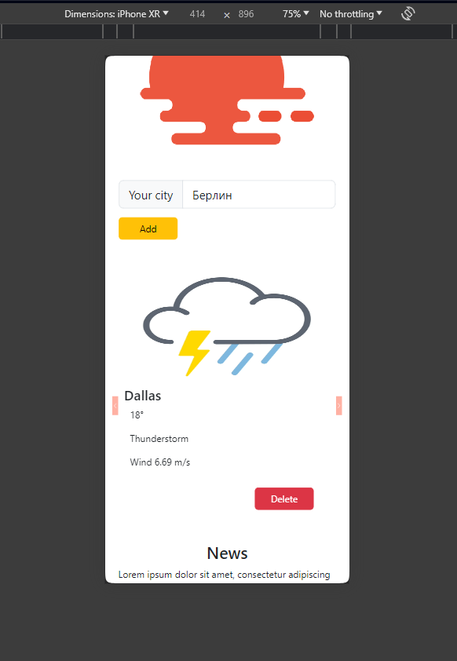
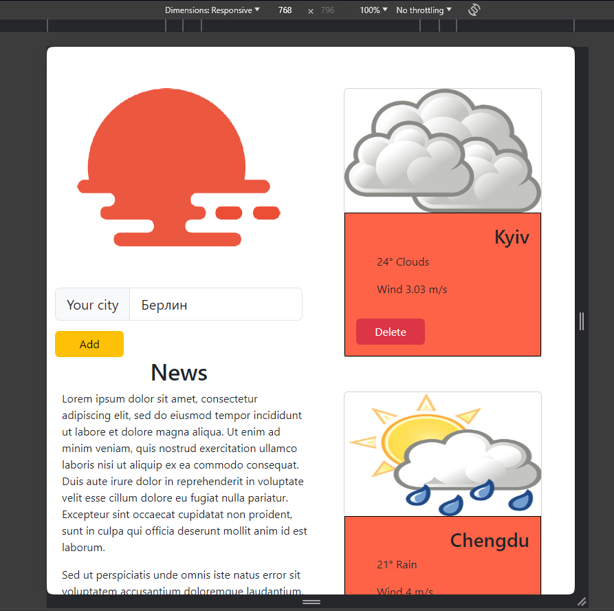

# Weather App

Weather App is a web application that allows you to check the weather in any city. You can create cards for cities to track the weather in multiple locations simultaneously. The application is adapted for different screens, including mobile devices, tablets, and desktops.

## Features

- Search for city weather.
- Add weather cards for various cities.
- Delete weather cards.
- Responsive design for mobile devices, tablets, and desktops.

## Technologies

The project is built using the following technologies:

- [React](https://reactjs.org/)
- [React-Bootstrap](https://react-bootstrap.github.io/)
- [Redux](https://redux.js.org)

## Components

### MainPage

The main page of the application, where the logo, search bar, and weather cards for added cities are displayed.

### WeatherCard

A component that displays weather information for a specific city, including the city name, temperature, weather description, and wind speed.

### WeatherCarousel

A carousel component used to display weather information on mobile devices.

## Screenshots

### Desktop Version

### Mobile Version

### Tablet Version

